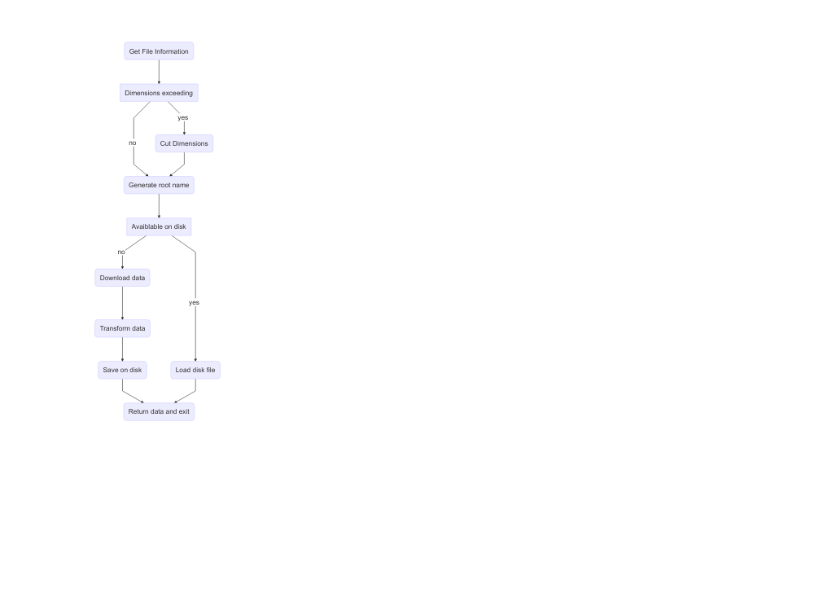

---
output:
  md_document:
    variant: markdown_github
---

<!-- README.md is generated from README.Rmd. Please edit that file -->

```{r, echo = FALSE}
knitr::opts_chunk$set(
  collapse = TRUE,
  comment = "#>",
  fig.path = "README-"
)
```

# knmiR

[](https://travis-ci.org/MartinRoth/knmiR)
[](https://codecov.io/github/MartinRoth/knmiR?branch=master)

```{r, Libraries, echo=FALSE}
library(DiagrammeR)
library(DiagrammeRsvg)
library(magrittr)
library(htmlwidgets)
library(webshot)
```

```{r, CreateExampleGraph, include=FALSE}
graph <- DiagrammeR::mermaid("
  graph TB
  A(Get File Information) --> B[Dimensions exceeding]
  B --> |yes|C(Cut Dimensions)
  B --> |no|D(Generate root name)
  C --> D
  D --> E[Avaiblable on disk]
  E --> |yes|F(Load disk file)
  E --> |no|G(Download data)
  G --> H(Transform data)
  H --> I(Save on disk)
  I --> J(Return data)
  F --> J
  ")
saveWidget(graph, 'tmp.html', selfcontained=FALSE)
webshot('tmp.html',
        file = 'inst/img/example_graph.png')


```



A package to access KNMI data within R.

Please, if there are any issues of any kind, file an issue [here](https://github.com/MartinRoth/knmiR/issues).

## General
The data can be downloaded ususally in the following scheme `Dataset(location, period, ...)`. The `location` can have the following forms:

-   `integer` identifying the station (in the case of station data)
-   `SpatialPoint` closest station (grid box) time series in the case of station (gridded) data
-   `SpatialPolygon` (or `bbox`) all stations (grid boxes) in the given spatial extent

The `period` is to follow the `xts` form, e.g. `"2010/2015"` for all data in the years 2010-2015.

## Homogenized precipitation data
To use this data please cite [Buishand et al. (2013): Homogeneity of precipitation series in the Netherlands and their trends in the past century](http://onlinelibrary.wiley.com/doi/10.1002/joc.3471/abstract). At the moment the data are obtained via the [KNMI climate explorer](http://climexp.knmi.nl/).

`HomogenPrecip(550, "1910/2015")` obtains the homogenized preciptiation data for the station with stationId 550 for the period 1910 - 2015. The available stations are reported in the data.frame stationMetaData. From this we can see that stationId 550 belongs to De Bilt. With an object `area` (extending `SpatialPolygons`) we can get all precipitation data in the given area, using `HomogenPrecip(area, "1910/2015")`.

## Earthquake data
`Earthquakes("induced")` provides all induced earthquakes from the KNMI earthquake catalogue. Natural, i.e. `tectonic` quakes, are also available. The data can be restricted to a specific area (extending `SpatialPolygons`) and a specific period. For instance `Earthquakes("induced", Groningen, "2015/2016")` obtaines all induced earthquakes for the Groningen reservoir (is shipped with the package) in the years 2015 and 2016. At the moment the earthquake data are obtained via [KNMI Aardbevingscatalogus](https://www.knmi.nl/kennis-en-datacentrum/dataset/aardbevingscatalogus).

## EOBS data

## Hail data
